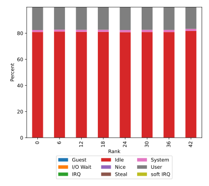
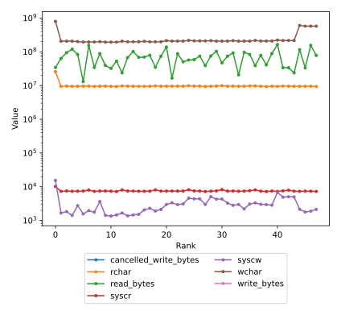
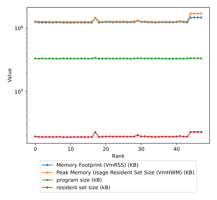
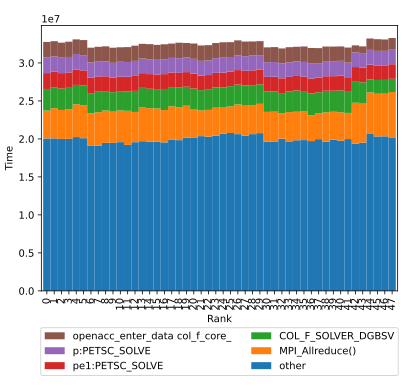

# Using the TAU to SVG Python Script

This script will parse the ADIOS2 output from TAU and generate SVG charts for each step in the ADIOS2 file.

## Generating an ADIOS2 file from TAU

TAU uses a couple of plugins to generate the periodic profile output to ADIOS2.  Some pre-requisites:

* ADIOS2 library with Python support
* TAU with ADIOS2 support
* Python with matplotlib, mpi4py, numpy, scipy, pandas (or anaconda)

To build TAU with ADIOS2 support, add the `-adios=<path-to-adios2-installation>` flag to the TAU configuration, or if using Spack, use the `+adios2` variant.  For complete TAU build instructions, see [https://github.com/UO-OACISS/tau2/wiki](https://github.com/UO-OACISS/tau2/wiki).

At runtime, the application is launched with:
```bash
jsrun <args> tau_exec -monitoring -adios2 <application> <args>
```

During execution, TAU will look for adios2.xml for the ADIOS2 parameters (it will default to BP file output if it is not found).  For the WDM example, the applications will have `PERFSTUBS_DUMP_DATA()` calls in them, which will send one step of TAU profile data to ADIOS2.  The output file will be named `tauprofile-<executable_name>.bp` by default.

## Reading the ADIOS2 output

The script will process the output when launched like this:

```bash
# Make sure ADIOS2 environment is set
export ADIOS_PATH=<path-to-adios2-installation>
# The path here is dependent on the python version
export PYTHONPATH=${ADIOS_PATH}/lib/python3.8/site-packages
export LD_LIBRARY_PATH=${ADIOS_PATH}/lib64:${LD_LIBRARY_PATH}
export PATH=${ADIOS_PATH}/bin:${PATH}

python ./tau2svg.py -i tauprofile-app.bp -c chart.json
```

Where the chart.json file contains the configuration for the charts desired.  See charts.json for examples of available charts.

The charts generated by this example will possibly look this (output from XGC run with 48 ranks on 8 nodes):





